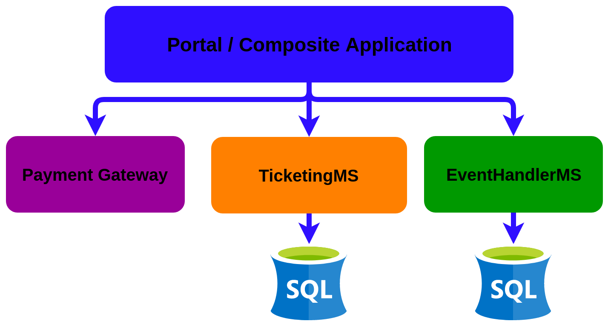
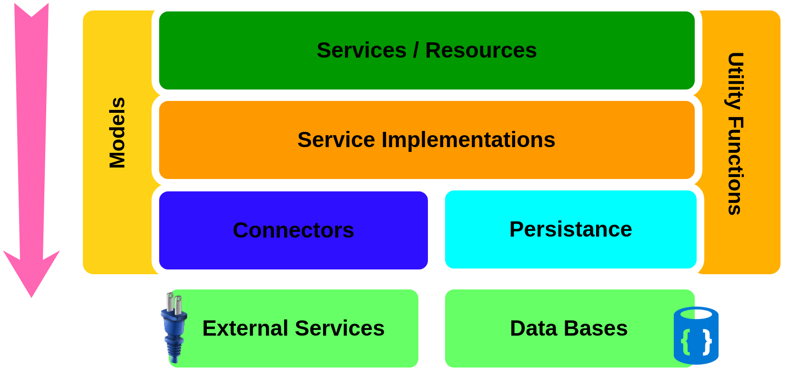
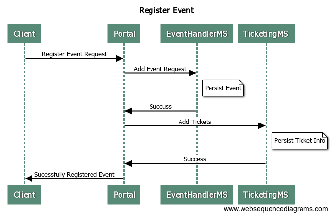
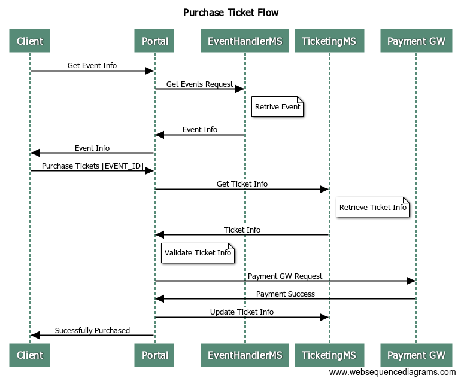
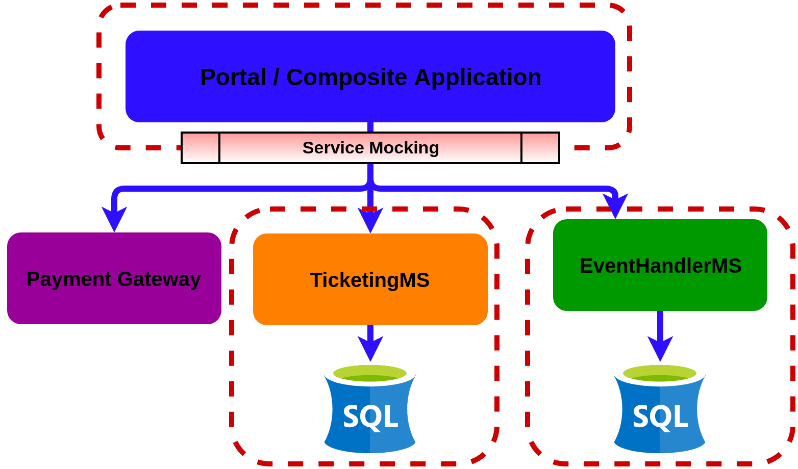
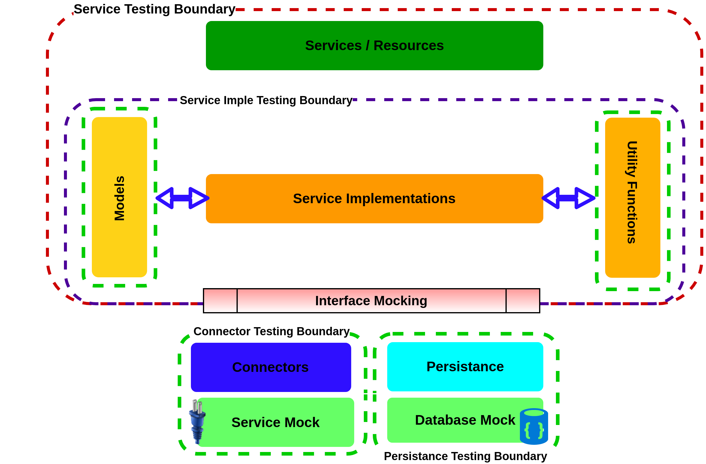

# Theatre Application  

In this guide you will learn about how a real ballerina solution can be tested with Testerina. 


## <a name="what-you-build"></a> What you’ll build
To understanding how you can build a Ballerina based solution, let’s consider a real world use case of an Theatre management scenario. 
We can model the application as collection of microservice which orchestrates the functional flow of the Theatre application. Theatre app contains 3 microservices. Following image depicts the high level architecture of the solution.





### Components
The Theatre app is made with 2 ballerina micro services and one third party service.

#### Portal (Composite service)
Portal acts as the composite service which does the plumbing between other microservices. (Ticketing, Event and Payment Gateway). Only the portal app will be exposed as the public user interface.

#### Event Handler MS
This service is responsible for handling event registering/ retrieving related request.

#### Ticketing MS

Ticketing service is responsible for handling ticketing related operations. Viewing available Tickets, purchasing tickets etc.


### Microservices Architecture

Following is the microservices component architecture each service follows. This architecture may vary from application to application.




### Message Flows
#### Register Event Message flow

Following sequence diagram depicts the event registration message flow.



#### Purchase Ticket Message flow
Following sequence diagram depicts the ticket purchasing message flow.




### Project Structure

````

Theatre
├── EventHandlerMS
│   ├── event.handler.model
│   │   ├── event.bal
│   │   └── tests
│   │       └── event_test.bal
│   ├── event.handler.persistence
│   │   ├── db_init.bal
│   │   ├── event_operations.bal
│   │   └── tests
│   │       └── event_operations_test.bal
│   ├── event.handler.serviceImpl
│   │   ├── event_service_Imple.bal
│   │   └── tests
│   │       └── event_service_Imple_test.bal
│   ├── event.handler.services
│   │   ├── event_service.bal
│   │   └── tests
│   │       └── event_service_test.bal
│   ├── event.handler.utils
│   │   ├── message_utils.bal
│   │   └── tests
│   │       └── message_utils_test.bal
│   └── tests
│       └── integration_test.bal
├── IntegrationTests
│   ├── service.integration
│   │   └── test_utils.bal
│   ├── service.mocks
│   └── tests
│       └── integration_test.bal
├── Portal
│   ├── portal.connectors
│   │   ├── event_service_client.bal
│   │   ├── payment_gateway_client.bal
│   │   └── ticket_service_client.bal
│   ├── portal.model
│   │   └── models.bal
│   ├── portal.serviceImpl
│   │   └── portal_service_Impl.bal
│   ├── portal.services
│   │   └── portal_service.bal
│   ├── portal.utils
│   │   ├── message_utils.bal
│   │   └── message_utils_test.bal
│   └── tests
│       └── inegrations_tests.bal
 |
└── TicketingMS
    ├── tests
    │   └── integration_tests.bal
    ├── ticketing.model
    │   └── models.bal
    ├── ticketing.persistence
    │   ├── db_init.bal
    │   ├── ticket_operations.bal
    │   └── ticket_operations_test.bal
    ├── ticketing.serviceImpl
    │   └── ticket_service_Impl.bal
    ├── ticketing.services
    │   ├── payment_gw_mock.bal
    │   └── ticket_service.bal
    └── ticketing.utils
        └── message_utils.bal

````

## <a name="pre-req"></a> Prerequisites
 
- JDK 1.8 or later
- [Ballerina Distribution](https://ballerinalang.org/docs/quick-tour/quick-tour/#install-ballerina)
- A Text Editor or an IDE. 

Optional Requirements
- Ballerina IDE plugins. ( Intellij IDEA, VSCode, Atom)

## <a name="developing-service"></a> Developing and Running Theatre Application 

Download the tools distribution and ballerina website.
Setup ballerina runtime by adding ballerina executable to runtime execution path.

Navigate to EventHandlerMS and execute

````shell
ballerina run event.handler.services
````

Now navigate to TicketingMS and execute and execute

````shell
ballerina run ticketing.services
````

Now start the composite portal service by navigating to Portal and executing      
````shell
ballerina run portal.services
````
Now you can perform following operation os the applications

### Add Events

Send a POST request to portal endpoint with the following payload.

````
Endpoint :

http://localhost:9090/portal/events
`````
````json
{
  "name": "Ballerina",
  "start_time": "5.25",
  "venue": "WSO2",
  "organizer_name": "Tyler",
  "event_type": "Ballet",
  "tickets": [
    {
      "ticket_type": "BALCONY",
      "total": 10,
      "booked": 0,
      "price": 250.00
    },
    {
      "ticket_type": "BOX",
      "total": 50,
      "booked": 0,
      "price": 1000.00
    }
  ]
}
````

### Get Existing Events

Send a get request to portal endpoint
 
 ````
 Endpoint :
 
 http://localhost:9090/portal/events
 ````
 
 Response
 
 ````
 [
   {
 "ID": 3,
 "NAME": "Ballerina54",
 "START_TIME": "5.25",
 "VENUE": "WSO2",
 "ORGANIZER_NAME": "Tyler"
 }
 ],
 ````

### Get Ticket info by Event ID

````
Endpoint : 

http://localhost:9090/portal/tickets/{Event_ID}
````

Response

````json
[
  {
"id": 3,
"event_id": 3,
"total": 10,
"booked": 0,
"ticket_type": "BALCONY",
"price": 250
},
  {
"id": 4,
"event_id": 3,
"total": 50,
"booked": 0,
"ticket_type": "BOX",
"price": 1000
}
]
````

### Purchasing Tickets

Send a Post request to portal endpoint
````
http://localhost:9090/portal/purchase
````

````json
{
  "eventId": {Event_ID},
  "ticket_type": "BOX",
  "noOfTickets": 5,
  "cardInfo": 
    {
      "cardNo": 5242536514,
      "cvcNo": 526,
      "expireDate": "11/2018",
      "cardHolderName": "Yasassri Ratnayake"
    }
}
````

## <a name="testing"></a> Testing 

### Testerina Basics
Testerina is made with few components,

Assertions
Mocks
Helper Functions

#### Assertions
Assertions are used to verify the outcome of a ballerina function program against the actual expected outcome. You can read more about assertions from the main user guides.

#### Mocks
Testerina allows you to create mocks or doubles at different layers for testing you application in the most efficient way. Using ballerina we can create,

Function Mocks.
Service Mocks.
DB mocks. (Only supports H2 database)

#### Helper Functions

Helper functions allow you to control ballerina tests, services and programs, Currently Testerina has the following helper functions.

Data providers.
Before and After test functions
Service management.

### Writing a Testable Ballerina Application.

Ballerina enables developers to practice test driven development adhering to best practices by design via Testerina. 
However, the framework will not guide and help you to decide on the granularity of the units, isolation from collaborators. This is a call that you need to make based on the nature of the application and project that you develop. Testing generally occupies a considerable time in the build cycle. Inorder to make sure we have optimized the testing phase, you can consider following strategies,

Design tests to support sociable and solitary testing.
Group the tests, so a component can be tested independently.
Maintain proper granularity and component isolation.
[ADD Explanations with the sample]


### Testing Layers

When testing a complete ballerina application we can perform the tests in three distinct layers. 

Unit layer.

An unit represents an isolated code fragment that can be tested without any external dependencies. For example, A function which adds two numbers and return the sum. You can refer the utility function tests of the Theatre application. 

Component Integration layer.

We can perform component integration tests when multiple components integrate with each other. For e.g: Persistence layer interacting with the DB, Service layer interacting with the service implementations etc. Refer the service tests in the Theatre application.

System integration layer.

System integration layer represents a production equivalent deployment of the entire solution. The system integration will mimic the actual production deployment and perform tests on top of this environment. You can refer integration test module to get an understanding about system integration tests. 
Identify Testable Components of the Theatre app.

If we look at the complete Theatre application we can identify following testable components. 



The composite application can be tested isolated by mocking the interactions with other microservices. Also other microservices can be considered as isolated units when designing tests.

If we dive further into individual microservices, following is how a microservice can be dissected into testable components. The basis for selecting components is the functional independence of each component. 



As shown in the above illustration, the components can be isolated and tested separately. Mocking capabilities can be used when decoupling the functional flow from each layer. If we look at the package structure of the Theatre application, the packages are designed to isolate components. So these components can be controlled individually. 


### <a name="invoking"></a> Invoking the service 


### <a name="deploying-on-docker"></a> Deploying on Docker


You can use the Ballerina executable archive (.balx) archive that we created above and create a docker image using either of the following commands. 
```
ballerina docker restful_service.balx  
```

Once you have created the docker image, you can run it using docker run. 

```
docker run -p <host_port>:9090 --name ballerina_restful_service -d restful_service:latest
```

### <a name="deploying-on-k8s"></a> Deploying on Kubernetes
(Work in progress) 


## <a name="observability"></a> Observability 

### <a name="logging"></a> Logging
(Work in progress) 

### <a name="metrics"></a> Metrics
(Work in progress)


### <a name="tracing"></a> Tracing 
(Work in progress) 


